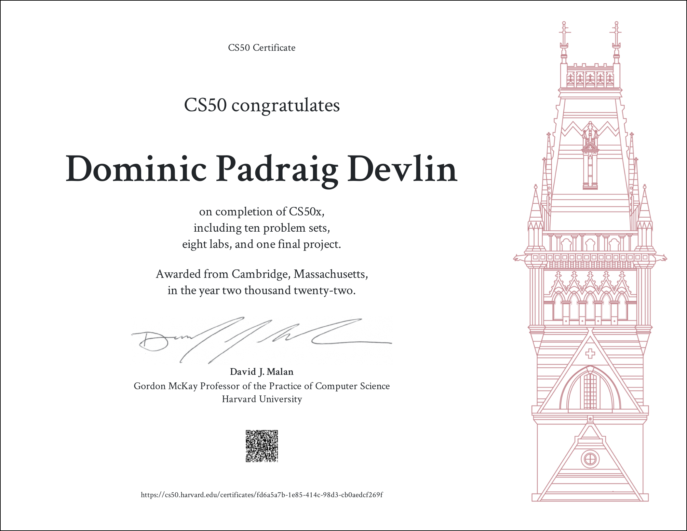

## Portfolio

---

### Data Science 

[Tip Distribution](notebooks/pandas_first.html)

###### Earthquake magnitude analysis

- [Earthquake Magnitude Analysis](notebooks/earthquake.html)
- [Earthquake Magnitude Analysis Presentation](pdf/Analysis of Location and Depth on Earthquake Magnitude.pdf)

---

### Python tests

- [Madlibs test](/madlibs.md)

- [Project 5 Title](http://example.com/)

---

### CS50x

- [Project 5 Title](http://example.com/)

---

---

Page template forked from <a href="https://github.com/evanca/quick-portfolio">evanca</a>

<!-- Remove above link if you don't want to attibute -->
